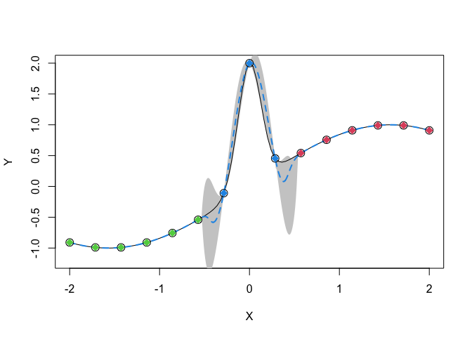

GPcluster
================
Chih-Li Sung
January 3, 2023

This R package allows the estimation and prediction for a clustered
Gaussian process model, which can deal with the nonstationarity issue
and computational issue for a standard Gaussian process model. The
estimation methods for the unknown parameters are based on a stochastic
EM algorithm. More details can be seen in [Sung, Haaland, Hwang, and Lu
(2023)](https://www3.stat.sinica.edu.tw/ss_newpaper/SS-2020-0456_na.pdf).

You can install the package using `install_github` function as follows:

``` r
library(devtools)
install_github("ChihLi/GPcluster")
```

    ## tgp  (2.4-19 -> 2.4-20) [CRAN]
    ## laGP (1.5-7  -> 1.5-8 ) [CRAN]
    ## 
    ## The downloaded binary packages are in
    ##  /var/folders/d1/cng8v70j0k33y9_6p7w5w_bc0000gr/T//RtmpUSiIQJ/downloaded_packages
    ## * checking for file ‘/private/var/folders/d1/cng8v70j0k33y9_6p7w5w_bc0000gr/T/RtmpUSiIQJ/remotes1090519f8d9fc/ChihLi-GPcluster-a38ee65/DESCRIPTION’ ... OK
    ## * preparing ‘GPcluster’:
    ## * checking DESCRIPTION meta-information ... OK
    ## * checking for LF line-endings in source and make files and shell scripts
    ## * checking for empty or unneeded directories
    ## Omitted ‘LazyData’ from DESCRIPTION
    ## * building ‘GPcluster_0.1.tar.gz’

A few examples are given below.

##### Gramacy and Lee (2009) test function

``` r
library(GPcluster)
data.df <- read.csv(system.file("extdata", "GL2009.csv", package = "GPcluster"))
X <- data.df$X
Y <- data.df$Y
X.test <- matrix(sort(c(X, seq(0,20,0.1))), ncol = 1)

set.seed(1)
fit.object <- GPcluster_fit(matrix(X, ncol = 1), Y, K = 2, iter_max = 100)
pred.out <- predict(fit.object, X.test, conf.level = 0.95)
yhat <- pred.out$yhat
plot(X, Y, ylim = c(-1.5,1.5), xlim = c(0,20), xlab = "x", ylab = "y", type = "n")
polygon(c(rev(X.test[,1]), X.test[,1]), c(rev(pred.out$UCL), pred.out$LCL), col = 'grey80', border = NA)

lines(X.test[,1], yhat, col = 4, lwd = 2, lty = 2)
curve(sin(pi*x/5) + 0.2*cos(4*pi*x/5), from = 0, to = 10, add = TRUE, lwd = 1)
curve(x/10 - 1, from = 10, to = 20, add = TRUE, lwd = 1)
points(X, Y, cex = 1.5)
for(i in 1:2) points(X[fit.object$P[[i]]], Y[fit.object$P[[i]]], col = c(2,3)[i], pch = 18, cex = 1.5)
```


##### Montagna and Tokdar (2016) test function

``` r
X <- seq(-2,2,length.out = 15)
Y <- sin(X) + 2*exp(-30*X^2)
X.test <- seq(-2,2,length.out = 500)
set.seed(1)

K <- 3
fit.object <- GPcluster_fit(matrix(X, ncol = 1), Y, K = K, iter_max = 100)

pred.out <- predict(fit.object, X.test, conf.level = 0.95)
yhat <- pred.out$yhat
plot(X, Y, ylim = c(-1.2,2), xlim = c(-2,2), type = "n")
polygon(c(rev(X.test), X.test), c(rev(pred.out$UCL), pred.out$LCL), col = 'grey80', border = NA)
curve(sin(x) + 2*exp(-30*x^2), from = -2, to = 2, add = TRUE, lwd = 1)
lines(X.test, yhat, col = 4, lwd = 2, lty = 2)
points(X, Y, cex = 1.5)
for(i in 1:K) points(X[fit.object$P[[i]]], Y[fit.object$P[[i]]], col = i+1, pch = 18, cex = 1.5)
```



##### borehole test function

``` r
borehole <- function(xx)
{
  rw <- 0.05  + xx[1] * 0.1
  r  <- 100   + xx[2] * 49900
  Tu <- 63070 + xx[3] * 52530
  Hu <- 990   + xx[4] * 120
  Tl <- 63.1  + xx[5] * 52.9
  Hl <- 700   + xx[6] * 120
  L  <- 1120  + xx[7] * 560
  Kw <- 9855  + xx[8] * 2190

  frac1 <- 2 * pi * Tu * (Hu-Hl)

  frac2a <- 2*L*Tu / (log(r/rw)*rw^2*Kw)
  frac2b <- Tu / Tl
  frac2 <- log(r/rw) * (1+frac2a+frac2b)

  y <- frac1 / frac2
  return(y)
}

#####   Training data and testing data   #####
set.seed(1)
n <- 1000; n_new <- 10000; d <- 8
X.train <- matrix(runif(d*n), ncol = d)
Y.train <- apply(X.train, 1, borehole)
X.test <- matrix(runif(d*n_new), ncol = d)
Y.test <- apply(X.test, 1, borehole)

#####   Fitting    #####
fit.object <- GPcluster_fit(X.train, Y.train, K = 5, iter_max = 5)
```

    ## no reps detected in meanPerReps, returning originals...
    ## ...done
    ## ...done
    ## ...done
    ## ...done
    ## ...done
    ## no reps detected in meanPerReps, returning originals...
    ## ...done
    ## ...done
    ## ...done
    ## ...done
    ## ...done
    ## no reps detected in meanPerReps, returning originals...
    ## ...done
    ## ...done
    ## ...done
    ## ...done
    ## ...done
    ## no reps detected in meanPerReps, returning originals...
    ## ...done
    ## ...done
    ## ...done
    ## ...done
    ## ...done
    ## no reps detected in meanPerReps, returning originals...
    ## ...done
    ## ...done
    ## ...done
    ## ...done
    ## ...done
    ## # weights:  50 (36 variable)
    ## initial  value 1609.437912 
    ## iter  10 value 246.691270
    ## iter  20 value 40.851628
    ## iter  30 value 14.715404
    ## iter  40 value 2.006630
    ## iter  50 value 0.022966
    ## final  value 0.000075 
    ## converged
    ## no reps detected in meanPerReps, returning originals...
    ## ...done
    ## ...done
    ## ...done
    ## ...done
    ## ...done
    ## no reps detected in meanPerReps, returning originals...
    ## ...done
    ## ...done
    ## ...done
    ## ...done
    ## ...done
    ## no reps detected in meanPerReps, returning originals...
    ## ...done
    ## ...done
    ## ...done
    ## ...done
    ## ...done
    ## no reps detected in meanPerReps, returning originals...
    ## ...done
    ## ...done
    ## ...done
    ## ...done
    ## ...done
    ## no reps detected in meanPerReps, returning originals...
    ## ...done
    ## ...done
    ## ...done
    ## ...done
    ## ...done
    ## # weights:  50 (36 variable)
    ## initial  value 1609.437912 
    ## iter  10 value 245.481595
    ## iter  20 value 85.909782
    ## iter  30 value 67.835782
    ## iter  40 value 64.571748
    ## iter  50 value 64.372361
    ## iter  60 value 64.310985
    ## iter  70 value 64.301168
    ## final  value 64.301128 
    ## converged
    ## [1] 0.1260557
    ## no reps detected in meanPerReps, returning originals...
    ## ...done
    ## ...done
    ## ...done
    ## ...done
    ## ...done
    ## no reps detected in meanPerReps, returning originals...
    ## ...done
    ## ...done
    ## ...done
    ## ...done
    ## ...done
    ## no reps detected in meanPerReps, returning originals...
    ## ...done
    ## ...done
    ## ...done
    ## ...done
    ## ...done
    ## no reps detected in meanPerReps, returning originals...
    ## ...done
    ## ...done
    ## ...done
    ## ...done
    ## ...done
    ## no reps detected in meanPerReps, returning originals...
    ## ...done
    ## ...done
    ## ...done
    ## ...done
    ## ...done
    ## # weights:  50 (36 variable)
    ## initial  value 1609.437912 
    ## iter  10 value 373.031034
    ## iter  20 value 278.492000
    ## iter  30 value 266.878571
    ## iter  40 value 266.579631
    ## final  value 266.576512 
    ## converged
    ## [1] 0.1260557
    ## no reps detected in meanPerReps, returning originals...
    ## ...done
    ## ...done
    ## ...done
    ## ...done
    ## ...done
    ## no reps detected in meanPerReps, returning originals...
    ## ...done
    ## ...done
    ## ...done
    ## ...done
    ## ...done
    ## no reps detected in meanPerReps, returning originals...
    ## ...done
    ## ...done
    ## ...done
    ## ...done
    ## ...done
    ## no reps detected in meanPerReps, returning originals...
    ## ...done
    ## ...done
    ## ...done
    ## ...done
    ## ...done
    ## no reps detected in meanPerReps, returning originals...
    ## ...done
    ## ...done
    ## ...done
    ## ...done
    ## ...done
    ## # weights:  50 (36 variable)
    ## initial  value 1609.437912 
    ## iter  10 value 478.907720
    ## iter  20 value 350.294395
    ## iter  30 value 343.194266
    ## iter  40 value 342.559340
    ## final  value 342.555810 
    ## converged
    ## [1] 0.1260557
    ## no reps detected in meanPerReps, returning originals...
    ## ...done
    ## ...done
    ## ...done
    ## ...done
    ## ...done
    ## no reps detected in meanPerReps, returning originals...
    ## ...done
    ## ...done
    ## ...done
    ## ...done
    ## ...done
    ## no reps detected in meanPerReps, returning originals...
    ## ...done
    ## ...done
    ## ...done
    ## ...done
    ## ...done
    ## no reps detected in meanPerReps, returning originals...
    ## ...done
    ## ...done
    ## ...done
    ## ...done
    ## ...done
    ## no reps detected in meanPerReps, returning originals...
    ## ...done
    ## ...done
    ## ...done
    ## ...done
    ## ...done
    ## # weights:  50 (36 variable)
    ## initial  value 1609.437912 
    ## iter  10 value 641.750513
    ## iter  20 value 468.714626
    ## iter  30 value 456.541371
    ## iter  40 value 455.312432
    ## iter  50 value 455.302153
    ## iter  50 value 455.302151
    ## iter  50 value 455.302151
    ## final  value 455.302151 
    ## converged
    ## [1] 0.1260557
    ## no reps detected in meanPerReps, returning originals...
    ## ...done
    ## ...done
    ## ...done
    ## ...done
    ## ...done
    ## no reps detected in meanPerReps, returning originals...
    ## ...done
    ## ...done
    ## ...done
    ## ...done
    ## ...done
    ## no reps detected in meanPerReps, returning originals...
    ## ...done
    ## ...done
    ## ...done
    ## ...done
    ## ...done
    ## no reps detected in meanPerReps, returning originals...
    ## ...done
    ## ...done
    ## ...done
    ## ...done
    ## ...done
    ## no reps detected in meanPerReps, returning originals...
    ## ...done
    ## ...done
    ## ...done
    ## ...done
    ## ...done
    ## # weights:  50 (36 variable)
    ## initial  value 1609.437912 
    ## iter  10 value 700.187927
    ## iter  20 value 515.009915
    ## iter  30 value 505.320383
    ## iter  40 value 504.449407
    ## final  value 504.439919 
    ## converged
    ## [1] 0.1260557
    ## [1] 0.1260557

``` r
#####   Prediction   ######
Y.pred <- predict(fit.object, X.test)$yhat
print(sqrt(mean((Y.test - Y.pred)^2)))
```

    ## [1] 0.1383529

##### borehole test function: parallel computing

``` r
library(doParallel)
```

    ## Loading required package: foreach

    ## Loading required package: iterators

    ## Loading required package: parallel

``` r
library(snowfall)
```

    ## Loading required package: snow

    ## 
    ## Attaching package: 'snow'

    ## The following objects are masked from 'package:parallel':
    ## 
    ##     clusterApply, clusterApplyLB, clusterCall, clusterEvalQ,
    ##     clusterExport, clusterMap, clusterSplit, makeCluster, parApply,
    ##     parCapply, parLapply, parRapply, parSapply, splitIndices,
    ##     stopCluster

``` r
sfInit(parallel = TRUE, cpus = 5L) # request 5 CPUs
```

    ## Warning in searchCommandline(parallel, cpus = cpus, type = type, socketHosts
    ## = socketHosts, : Unknown option on commandline: rmarkdown::render('/
    ## Users/sungchih/Library/CloudStorage/OneDrive-MichiganStateUniversity/
    ## Research/[Bib]Computer~+~Experiment/Nonstationary~+~GP/GPcluster/
    ## README.Rmd',~+~~+~encoding~+~

    ## R Version:  R version 4.1.2 (2021-11-01)

    ## snowfall 1.84-6.2 initialized (using snow 0.4-4): parallel execution on 5 CPUs.

``` r
cl <- sfGetCluster()
registerDoParallel(cl)

######   Fitting    #####
fit.object <- GPcluster_fit(X.train, Y.train, K = 5, iter_max = 5, parallel = TRUE)
```

    ## # weights:  50 (36 variable)
    ## initial  value 1609.437912 
    ## iter  10 value 294.505138
    ## iter  20 value 57.813457
    ## iter  30 value 1.864008
    ## iter  40 value 0.004080
    ## final  value 0.000074 
    ## converged
    ## # weights:  50 (36 variable)
    ## initial  value 1609.437912 
    ## iter  10 value 383.154285
    ## iter  20 value 129.350613
    ## iter  30 value 108.634128
    ## iter  40 value 107.986157
    ## iter  50 value 107.821573
    ## iter  60 value 107.810087
    ## final  value 107.809469 
    ## converged
    ## [1] 0.1618682
    ## # weights:  50 (36 variable)
    ## initial  value 1609.437912 
    ## iter  10 value 411.228995
    ## iter  20 value 255.788293
    ## iter  30 value 250.897867
    ## iter  40 value 250.577804
    ## final  value 250.558736 
    ## converged
    ## [1] 0.1618682
    ## # weights:  50 (36 variable)
    ## initial  value 1609.437912 
    ## iter  10 value 468.050593
    ## iter  20 value 344.509394
    ## iter  30 value 341.075024
    ## iter  40 value 340.995077
    ## final  value 340.994488 
    ## converged
    ## [1] 0.1030348
    ## # weights:  50 (36 variable)
    ## initial  value 1609.437912 
    ## iter  10 value 436.293138
    ## iter  20 value 360.238420
    ## iter  30 value 355.640987
    ## iter  40 value 355.547614
    ## final  value 355.546380 
    ## converged
    ## [1] 0.1030348
    ## # weights:  50 (36 variable)
    ## initial  value 1609.437912 
    ## iter  10 value 525.043624
    ## iter  20 value 433.192086
    ## iter  30 value 429.476066
    ## iter  40 value 429.254826
    ## final  value 429.254735 
    ## converged
    ## [1] 0.1030348
    ## [1] 0.1030348

``` r
#####   Prediction   ######
Y.pred <- predict(fit.object, X.test, parallel = TRUE)$yhat
print(sqrt(mean((Y.test - Y.pred)^2)))
```

    ## [1] 0.1021334

``` r
sfStop()
```

    ## 
    ## Stopping cluster
