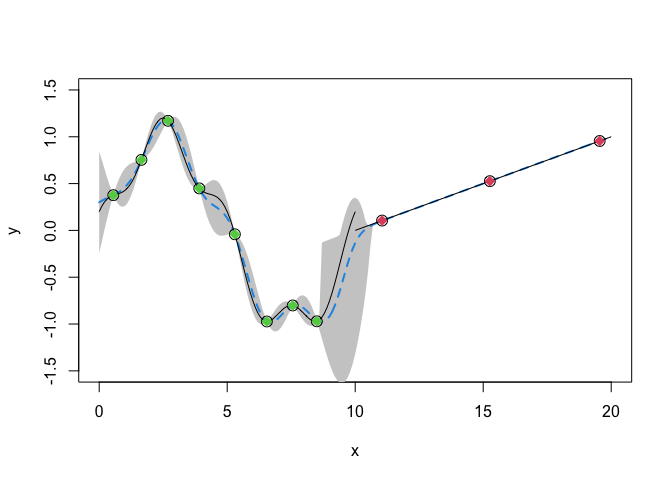

GPcluster
================
Chih-Li Sung
January 3, 2023

This R package allows the estimation and prediction for a clustered
Gaussian process model, which can deal with the nonstationarity issue
and computational issue for a standard Gaussian process model. The
estimation methods for the unknown parameters are based on a stochastic
EM algorithm. More details can be seen in [Sung, Haaland, Hwang, and Lu
(2023)](https://www3.stat.sinica.edu.tw/ss_newpaper/SS-2020-0456_na.pdf).

You can install the package using `install_github` function as follows:

``` r
library(devtools)
install_github("ChihLi/GPcluster")
```

A few examples are given below.

##### Gramacy and Lee (2009) test function

``` r
library(GPcluster)
data.df <- read.csv(system.file("extdata", "GL2009.csv", package = "GPcluster"))
X <- data.df$X
Y <- data.df$Y
X.test <- matrix(sort(c(X, seq(0,20,0.1))), ncol = 1)

set.seed(1)
fit.object <- GPcluster_fit(matrix(X, ncol = 1), Y, K = 2, iter_max = 100)
pred.out <- predict(fit.object, X.test, conf.level = 0.95)
yhat <- pred.out$yhat
plot(X, Y, ylim = c(-1.5,1.5), xlim = c(0,20), xlab = "x", ylab = "y", type = "n")
polygon(c(rev(X.test[,1]), X.test[,1]), c(rev(pred.out$UCL), pred.out$LCL), col = 'grey80', border = NA)

lines(X.test[,1], yhat, col = 4, lwd = 2, lty = 2)
curve(sin(pi*x/5) + 0.2*cos(4*pi*x/5), from = 0, to = 10, add = TRUE, lwd = 1)
curve(x/10 - 1, from = 10, to = 20, add = TRUE, lwd = 1)
points(X, Y, cex = 1.5)
for(i in 1:2) points(X[fit.object$P[[i]]], Y[fit.object$P[[i]]], col = c(2,3)[i], pch = 18, cex = 1.5)
```



##### Montagna and Tokdar (2016) test function

``` r
X <- seq(-2,2,length.out = 15)
Y <- sin(X) + 2*exp(-30*X^2)
X.test <- seq(-2,2,length.out = 500)
set.seed(1)

K <- 3
fit.object <- GPcluster_fit(matrix(X, ncol = 1), Y, K = K, iter_max = 100)

pred.out <- predict(fit.object, X.test, conf.level = 0.95)
yhat <- pred.out$yhat
plot(X, Y, ylim = c(-1.2,2), xlim = c(-2,2), type = "n")
polygon(c(rev(X.test), X.test), c(rev(pred.out$UCL), pred.out$LCL), col = 'grey80', border = NA)
curve(sin(x) + 2*exp(-30*x^2), from = -2, to = 2, add = TRUE, lwd = 1)
lines(X.test, yhat, col = 4, lwd = 2, lty = 2)
points(X, Y, cex = 1.5)
for(i in 1:K) points(X[fit.object$P[[i]]], Y[fit.object$P[[i]]], col = i+1, pch = 18, cex = 1.5)
```


##### borehole test function

``` r
borehole <- function(xx)
{
  rw <- 0.05  + xx[1] * 0.1
  r  <- 100   + xx[2] * 49900
  Tu <- 63070 + xx[3] * 52530
  Hu <- 990   + xx[4] * 120
  Tl <- 63.1  + xx[5] * 52.9
  Hl <- 700   + xx[6] * 120
  L  <- 1120  + xx[7] * 560
  Kw <- 9855  + xx[8] * 2190

  frac1 <- 2 * pi * Tu * (Hu-Hl)

  frac2a <- 2*L*Tu / (log(r/rw)*rw^2*Kw)
  frac2b <- Tu / Tl
  frac2 <- log(r/rw) * (1+frac2a+frac2b)

  y <- frac1 / frac2
  return(y)
}

#####   Training data and testing data   #####
set.seed(1)
n <- 1000; n_new <- 10000; d <- 8
X.train <- matrix(runif(d*n), ncol = d)
Y.train <- apply(X.train, 1, borehole)
X.test <- matrix(runif(d*n_new), ncol = d)
Y.test <- apply(X.test, 1, borehole)

#####   Fitting    #####
tic <- proc.time()[3]
fit.object <- GPcluster_fit(X.train, Y.train, K = 5, iter_max = 5)
```

``` r
toc <- proc.time()[3]
```

``` r
# fitting time
print(toc-tic)
```

    ## elapsed 
    ## 799.706

``` r
#####   Prediction   ######
Y.pred <- predict(fit.object, X.test)$yhat
print(sqrt(mean((Y.test - Y.pred)^2)))
```

    ## [1] 0.1383529

##### borehole test function: parallel computing

``` r
library(doParallel)
library(snowfall)
sfInit(parallel = TRUE, cpus = 5L) # request 5 CPUs
cl <- sfGetCluster()
registerDoParallel(cl)

######   Fitting    #####
tic <- proc.time()[3]
fit.object <- GPcluster_fit(X.train, Y.train, K = 5, iter_max = 5, parallel = TRUE)
toc <- proc.time()[3]
# fitting time
print(toc-tic)
```

    ## elapsed 
    ## 182.722

``` r
#####   Prediction   ######
Y.pred <- predict(fit.object, X.test, parallel = TRUE)$yhat
print(sqrt(mean((Y.test - Y.pred)^2)))
```

    ## [1] 0.1021334

``` r
sfStop()
```

    ## 
    ## Stopping cluster
